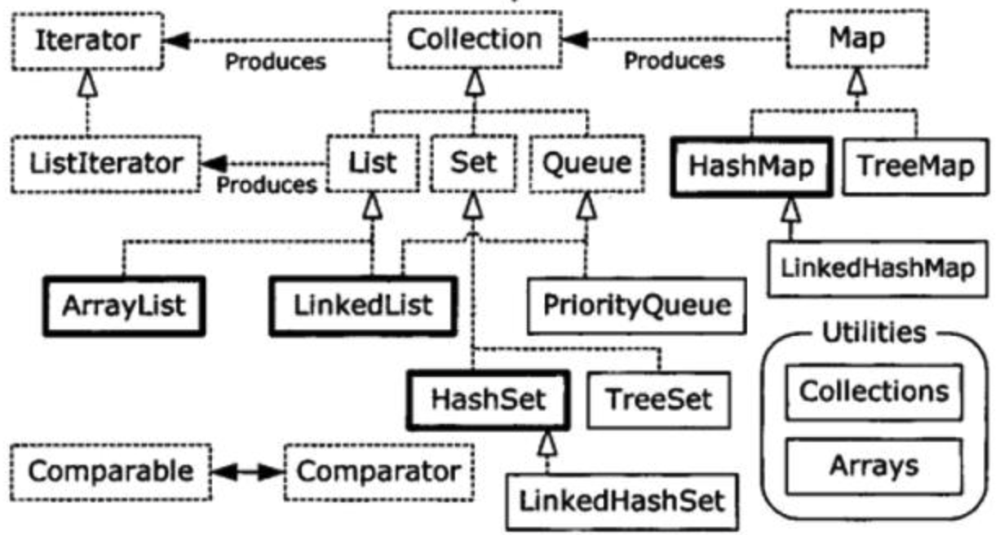

面临**耦合性、内聚性、可维护性、可扩展性、重用性、灵活性**等方面挑战，通过设计模式使程序具有更好的：

代码重用性、可读性、可扩展性、可靠性、高内聚低耦合

##  设计模式七大原则

1. 单一职责原则

2. 接口隔离原则

3. 依赖倒转（倒置）

   原则: **面向接口编程**

   三种方式：

   ​	通过接口传递实现依赖

   ​	通过构造方法依赖传递

   ​	通过setter实现 

4. 里氏替换原则

   继承可能带来侵入性，可移植性降低，父类修改要考虑所有的子类

   **在使用继承时**，子类中尽量**不要重写父类的方法**(继承增加了耦合性，可以通过聚合、组合、依赖来解决问题)

5. 开闭原则

    **对扩展开发**（对提供方），对修改关闭（对使用方）

6. 迪米特法则

   封装类内部信息，对外提供public方法，**最少知道原则**

   只与**直接朋友**通信：出现**成员变量、方法参数、方法返回值**中的类为直接朋友，出现在局部变量的类不是直接朋友。

7. 合成复用原则

   尽量使用合成/聚合，而不是使用继承


## UML 图

1. 用例图
2. 静态结构图：类图、对象图、包图、组件图、部署图
3. 动态行为图：交互图（时序图与协作图）、状态图、活动图

###  UML 类图

#### 1.类图基础属性


```none
-表示private  
#表示protected 
~表示default,也就是包权限  
_下划线表示static  
斜体表示抽象  
```

#### 2.类与类之间关系

在UML类图中，常见的有以下几种关系: **泛化（Generalization）, 实现（Realization），关联（Association)，聚合（Aggregation），组合(Composition)，依赖(Dependency)**


##### 2.1泛化

**介绍：**  
 泛化(Generalization)表示类与类之间的继承关系，接口与接口之间的继承关系，或类对接口的实现关系

（1）继承
 **介绍：**   

 继承表示是一个类（称为子类、子接口）继承另外的一个类（称为父类、父接口）的功能，并可以增加它自己的新功能的能力。
 **表示方法：**  

 继承使用**空心三角形+实线**表示。
 **示例：**  

 鸟类继承抽象类动物


（2）实现
 **介绍：**   

 实现表示一个class类实现interface接口（可以是多个）的功能。
 **表示方法：**

​	1）**矩形表示法**  

​	 	使用**空心三角形+虚线**表示
 		比如：大雁需要飞行，就要实现飞()接口


​	2）**棒棒糖表示法**  

​		使用**实线**表示


##### 2.2依赖

**介绍：**   

对于两个相对独立的对象，当一个对象负责构造另一个对象的实例，或者依赖另一个对象的服务时，这两个对象之间主要体现为依赖关系。

**表示方法：**   

依赖关系用**虚线箭头**表示。

 **示例：**   

 动物依赖氧气和水。调用新陈代谢方法需要氧气类与水类的实例作为参数


##### 2.3关联

**介绍：**   

对于两个相对独立的对象，当一个对象的实例与另一个对象的一些特定实例存在固定的对应关系时，这两个对象之间为关联关系。

 **表示方法：**   

关联关系用**实线箭头**表示。

**示例：**   

企鹅需要‘知道’气候的变化，需要‘了解’气候规律。当一个类‘知道’另一个类时，可以用关联。


##### 2.4聚合

**介绍：**   

表示一种弱的‘拥有’关系，即has-a的关系，体现的是A对象可以包含B对象，但B对象不是A对象的一部分。 **两个对象具有各自的生命周期**。

**表示方法：**   

聚合关系用**空心的菱形+实线箭头**表示。

**示例：**   

每一只大雁都属于一个大雁群，一个大雁群可以有多只大雁。当大雁死去后大雁群并不会消失，两个对象生命周期不同。


##### 2.5组合

**介绍：**   

组合是一种强的‘拥有’关系，是一种contains-a的关系，体现了严格的部分和整体关系，**部分和整体的生命周期一样**。

**表示方法：**  

组合关系用**实心的菱形+实线箭头**表示，还可以使用连线两端的数字表示某一端有几个实例。

**示例：**   

鸟和翅膀就是组合关系，因为它们是部分和整体的关系，并且翅膀和鸟的生命周期是相同的。


## 设计模式概述

### 设计模式分类

1. **创建型模式**：**单例模式**、抽象工厂模式、原型模式、建造者模式、**工厂模式**
2. **结构型模式**：适配器模式、桥接模式、**装饰模式**、组合模式、外观模式、享元模式、**代理模式**
3. **行为型模式**：模板方法模式、命令模式、访问者模式、迭代器模式、**观察者模式**、中介者模式、备忘录模式、解释器模式、状态模式、策略模式、责任链模式

### 创建型模式

#### 单例模式 Singleton

java中java.lang.Runtime 就是单例模式

##### 1. 饿汉式（静态常量）

可能造成内存浪费，避免了多线程同步问题

```java
class Singleton() {
    // 构造器私有化
    private Singleton() {}
    //本类创建
    private final static Singleton instance = new Singleton();
    //提供getter
    public getInstance() {
        return instance;
    }
    
}
```

##### 2. 饿汉式（静态代码块）

同理造成内存浪费

```java
class Singleton() {
    private static Singleton instance;
    //通过静态代码块创建单例对象
    static {
        instance = new Singleton();
    }
    //提供getter
    public getInstance() {
        return instance;
    }
    
}
```

##### 3. 懒汉式（线程不安全）

```java
class Singleton() {
    private static Singleton instance;
    private Singleton() {}
    //提供getter
    public static Singleton getInstance() {
        if(instance == null) {
            instance = new Singleton();
        }
        return instance;
    }
    
}
```

##### 4. 懒汉式（线程安全）

方法同步效率太低

```java
class Singleton() {
    private static Singleton instance;
    private Singleton() {}
    //提供getter
    public static synchronized Singleton getInstance() {
        if(instance == null) {
            instance = new Singleton();
        }
        return instance;
    }
    
}
```

##### 5. 双重检查

```java
class Singleton() {
    //volatile 禁止指令重排
    private static volatile Singleton instance;
    private Singleton() {}
    public static Singleton getInstance() {
        if(instance == null) {
            synchronized (Singleton.class) {
                if(instance == null) {
                    instance = new Singleton();
                }
            }
        }
        return instance;
    } 
}
```

##### **6. 静态内部类**

```java
class Singleton() {
  private Singleton() {}
  //懒加载 线程安全 静态内部类
  public static class SingletonInstance {
    private static final Singleton INSTANCE = new Singleton();
  }
  public static Singleton getInstance() {
    return SingletonInstance.INSTANCE;
  }
}
```

##### **7. 枚举**

避免多线程，还能防止反序列化重新创建新的对象

```java
enum Singleton {
  //属性单一
  INSTANCE;
  public vod sayOK() {}
}
```


#### 工厂模式 Factory

java中Calendar就是工厂模式

##### 1. 简单工厂模式


```java
public class PhoneFactory {
    public Phone makePhone(String phoneType) {
        if(phoneType.equalsIgnoreCase("MiPhone")){
            return new MiPhone();
        }
        else if(phoneType.equalsIgnoreCase("iPhone")) {
            return new IPhone();
        }
        return null;
    }
}
```

##### 2. 工厂方法模式

定义一个抽象工厂，定义生产接口但不具体负责产品，交给派生类工厂来生产。


```java
public interface AbstractFactory {
    Phone makePhone();
}
```

##### 3. 抽象工厂模式

在AbstractFactory增加创建产品的接口，在具体子工厂中实现新加产品的创建。


#### 原型模式 Prototype

可以简化创建对象过程。需要为每一个类配备克隆方法，对于已有类进行改造时违背了OCP原则

java中Object类是所有类的根类，提供一个clone()方法，可以复制对象，需要实现接口Cloneable**（浅拷贝）**

spring中创建bean可以采用原型模式

```xml
<bean id="id01" class="com.jackyjinchen.bean.Test" scope="prototype"/>
```


```java
// Cloneable 浅拷贝
// clone方法的原理是从堆内存中以二进制流的方式进行拷贝，直接分配一块新内存。
public abstract class Shape implements Cloneable {
   //.......
   @Override
   public Object clone() {
      Object clone = null;
      try {
         clone = super.clone();
      } catch (CloneNotSupportedException e) {
         e.printStackTrace();
      }
      return clone;
   }
}
```


```java
// 深拷贝
public class DeepProtoType impements Serializable, Cloneable {
  public DeepCloneableTarget deepCloneableTarget; //引用类型
  
  // 方法1
  @Override
  public Object clone() {
    Object clone = null;
    try {
      //基本数据属性克隆
      clone = super.clone();
      //对应用类型的属性，进行单独处理
      DeepProtoType deep = (DeepProtoType)deep;
      deep.deepCloneableTarget = (DeepCloneableTarget)deepCloneableTarget.clone();
    } catch (CloneNotSupportedException e) {
      e.printStackTrace();
    }
    return clone;
  }
  
  // 方法2
  public DeepProtoType deepClone() throws Exception {
    DeepProtoType clone = null;
    try {
      //将对象写到流里
      ByteArrayOutputStream bos = new ByteArrayOutputStream();
      ObjectOutputStream oos = new ObjectOutputStream(bos);
      oos.writeObject(this);
      //从流中读出来
      ByteArrayInputStream bis = new ByteArrayInputStream(bos.toByteArray());
      ObjectInputStream ois = new ObjectInputStream(bis);
      clone = (DeepProtoType) ois.readObject();
    } catch (CloneNotSupportedException e) {
      e.printStackTrace();
    } finally {
      bos.close();
      oos.close();
      bis.close();
      ois.close();
    }
    return clone;
  }
}
```

#### 建造者模式 Builder

java中的StringBuilder就是建造者模式


（1） 抽象产品类 computer。
（2） Builder 抽象 Builder，规范产品的组建，一般是由子类实现具体的组建过程。
（3）MacbookBuilder 具体的Builder类，具体的创建对象的类。
（4） Directror 统一组建过程。

### 结构型模式

#### 适配器模式 Adapter

将某个类的接口转换成客户端期望的另一个接口表示，主要目的是**兼容性**，别名包装器（Wrapper）。

SpinrgMVC 中的HandlerAdapter是使用适配器模式实现的

(1). 目标（Target）接口：当前系统业务所期待的接口，它可以是抽象类或接口。
(2). 适配者（Adaptee）类：它是被访问和适配的现存组件库中的组件接口。
(3). 适配器（Adapter）类：它是一个转换器，通过继承或引用适配者的对象，把适配者接口转换成目标接口，让客户按目标接口的格式访问适配者。

##### 1. 类适配器


```java
// 适配器类
public class VoltageAdapter extends Voltage220V implements IVoltage5V {
    // 通过实现接口的方法将电压转化
    @Override
    public int output5V() {
        // 获取到 220V 电压
        int srcV = output220V();
        // 转成 5V
        intdstV = srcV / 44;
        return dstV;
    }
}
```

##### 2. 对象适配器


```java
// 适配器类
public class VoltageAdapter implements IVoltage5V {

    // 关联关系-聚合
    private Voltage220V voltage220V;

    // 通过构造器，传入一个 Voltage220V 实例
    public VoltageAdapter(Voltage220V voltage220v) {
        this.voltage220V = voltage220v;
    }

    @Override
    public int output5V() {
        int dst = 0;
        if(null != voltage220V) {
            // 获取 220V 电压
            int src = voltage220V.output220V();
            System.out.println("使用对象适配器，进行适配~~");
            dst = src / 44;
            System.out.println("适配完成，输出的电压为=" + dst);
        }
        return dst;
    }
}
```

##### 3. 接口适配器

适配器模式（Default Adapter Pattern）或缺省适配器模式


不需实现接口提供的全部方法，可以设计一个抽象类实现接口，每个方法提供一个默认实现，抽象类子类选择覆盖方法实现。

##### SpringMVC Dispatcher


1. 首先浏览器发送请求给`DispatcherServlet`。
2. 前端控制器通过处理器映射器得到对应的映射路径。
3. 然后通过处理器适配器得到对应`controller`执行业务返回数据。
4. 通过视图解析器处理视图。
5. 返回视图给浏览器。

#### 桥接模式 Bridge

将实现与抽象放在两个不同的类层次中，是两个层次可以独立改变。基于类的**最小设计原则**


JDBC的Driver接口，是一个接口类。


桥接模式引入增加了系统的理解和设计难度，由于聚合关系建立在抽象层，要求开发者针对抽象进行设计和编程。

#### 装饰者模式 Decoration

装饰类和被装饰类独立发展，不会相互耦合，是集成的一个替代模式，可以动态扩展一个实现类的功能。


java的I/O中使用了装饰者模式


#### 组合模式 Composite

方便创建出复杂的层次结构，具有较强的扩展性。如果节点和叶子有很多差异性的话，不适合使用组合模式。


1. 抽象构件角色(Component)：是组合中对象声明接口，实现所有类共有接口的默认行为。
2. 树叶构件角色(Leaf)：上述提到的单个对象，叶节点没有子节点。
3. 树枝构件角色(Composite)：定义有子部件的组合部件行为，存储子部件，在Component接口中实现与子部件有关的操作。

java中的集合类**HashMap**就是用了组合模式。


1. Map 就是一个抽象的构件，类似于组合模式中的Component；
2. HashMap是中间的构件，只不过在HashMap与Component之间多了一层AbstractMap<K,V>，并且重写了Map中put()，putAll()等方法；
3. Node是HashMap中的静态内部类，类似于Leaf叶子节点

#### 外观模式 Facade

定义一个高层接口，包含对各个子系统的引用。


MyBatis框架中Configration去创建MetaObject对象使用到外观模式。

#### 享元模式 Flyweight

运用共享技术有效地支持大量细粒度的对象。常用于系统底层开发，解决系统性能问题，如数据库连接池等各种池技术。可以解决重复对象的内存浪费问3没出发呢题。


1. Flyweight是抽象享元角色。它是产品的抽象类，同时定义出对象的外部状态和内部状态的接口或实现；
2. ConcreteFlyweight是具体享元角色，是具体的产品类，实现抽象角色定义的业务；
3. UnsharedConcreteFlyweight是不可共享的享元角色，一般不会出现在享元工厂中；
4. FlyweightFactory是享元工厂，它用于构造一个池容器，同时提供从池中获得对象的方法。

  jdk中Interger源码中采用了享元模式

```java
// valueOf使用了享元模式，在-128 -- 127 直接使用享元模式返回，否则new一个对象。执行速度比new快。
Integer x = Integer.valueOf(127);
Integer y = new Integer(127);
Integer z = Integer.valueOf(127);
Integer w = new Integer(127);
System.out.println( x.equal(y) ); // true
System.out.println( x == y ); // false
System.out.println( x == z ); // true
System.out.println( w == x ); // false
System.out.println( w == y ); // false
```

#### 代理模式 Proxy

为对象提供一个替身，实现功能增强。被代理的对象可以使远程对象、创建开销大的对象或者需要安全控制的对象。

代理模式主要有三种：静态代理、动态代理（JDK代理、接口代理）、Cglib代理（可以在内存中动态创建对象，而不需要实现接口）

##### 静态代理


1. 定义接口ITeacherDAO
2. 目标对象TeacherDAO实现ITeacherDAO
3. TeacherDAOProxy实现ITeacherDAO，调用时候通过调用代理对象方法来调用目标对象。

##### 动态代理


代理类所在包：java.lang.reflect.Proxy

JDK实现代理只需要使用newProxyInstance方法

```java
// 1、类加载器
// 2、目标对象实现的接口类型，使用泛型方法确认类型
// 3、事情处理，执行目标对象的方法时，会触发事件处理器方法。
static Object newProxyInstance(ClassLoader loader, Class<?>[] interfaces, InvocationHandler h)
```

```java
public Object getProxyInstance() {
  return Proxy.newProxyInstance(target.getClass().getClassLoader(),
       target.getClass().getInterfaces(),
       new InvocationHandler() {
         @Override
         public Object invoke(Object proxy, Method method, Object[] args) {
           Object returnVal = method.invoke(target, args);
           return returnVal;
         }
       })
}
```

##### Cglib代理

被广泛应用于AOP框架，如Spring AOP，实现方法拦截。目标对象需要实现接口使用JDK代理，不需要则使用Cglib代理。

1. 引入jar包

   asm.jar
   asm.commons.jar
   asm-tree.jar
   cglib.jar

2. 代理的类不能为final，否则报错java.lang.illegalArgumentException
3. 目标对象的方法如果为final/static，那么就不会被拦截。

```java
public class ProxyFactory implements MethodInterceptor {
  private Object target;
  
  public ProxyFactory(Object target) {
    this.target = target;
  }
  
  public Object getProxyInstance() {
    //创建工具类
    Enhancer enhancer = new Enhancer();
    //设置父类
    enhancer.setSuperclass(target.getClass());
    //设置回调函数
    enhancer.setCallback(this);
    //创建子类对象，即代理对象
    return enhancer.create();
  }
  
  @Override
  public Object intercept(Object arg0, Method method, Object[] args, MethodProxy arg3) throw Throwable {
    Object returnVal = method.invoke(target, args);
    return returnVal;
  }
}
```

##### 动态代理和Cglib的区别

1. Java动态代理只能够对接口进行代理，不能对普通的类进行代理（因为所有生成的代理类的父类为Proxy，Java类继承机制不允许多重继承）；CGLIB能够代理普通类；
2. Java动态代理使用Java原生的反射API进行操作，在生成类上比较高效；CGLIB使用ASM框架直接对字节码进行操作，在类的执行过程中比较高效

### 行为型模式

#### 模板模式 Template

在一个抽象类公开定义了执行它的方法的模板，它的子类可以按需要重写方法实现，但调用将以抽象类中定义的方式进行。


templateMethod()中定义方法的基本步骤（可以做成final，不让子类去覆盖），ConcreteClass实现抽象方法中的doSomething()、doAnything()

##### 钩子方法

定义一个方法默认不做任何事，子类可以视情况覆盖，称之为“钩子”，可以用钩子方法对前面的模板进行改造。

```java
//在AbstractClass中定义一个钩子，在子类中覆盖他为return false，在运行时判断从而改变方法。
protected boolean customer() {
  return true;
}
```

Spring框架中IOC容器初始化时用到了模板方法模式。


#### 命令模式 Command

命令模式将动作的请求者从动作的执行着对象中解耦出来。


1. **客户端(Client)角色：**创建一个具体命令(ConcreteCommand)对象并确定其接收者。
2. **命令(Command)角色：**声明了一个给所有具体命令类的抽象接口。
3. **具体命令(ConcreteCommand)角色：**定义一个接收者和行为之间的弱耦合；实现execute()方法，负责调用接收者的相应操作。execute()方法通常叫做执行方法。
4. **请求者(Invoker)角色：**负责调用命令对象执行请求，相关的方法叫做行动方法。
5. **接收者(Receiver)角色：**负责具体实施和执行一个请求。任何一个类都可以成为接收者，实施和执行请求的方法叫做行动方法。

​		小女孩茱丽(Julia)有一个盒式录音机，此录音机有播音(Play)、倒带(Rewind)和停止(Stop)功能，录音机的键盘便是请求者(Invoker)角色；茱丽(Julia)是客户端角色，而录音机便是接收者角色。Command类扮演抽象命令角色，PlayCommand、StopCommand和RewindCommand便是具体命令类。茱丽(Julia)不需要知道播音(play)、倒带(rewind)和停止(stop)功能是怎么具体执行的，这些命令执行的细节全都由键盘(Keypad)具体实施。茱丽(Julia)只需要在键盘上按下相应的键便可以了。


Spring框架中JdbcTemplate就使用到了命令模式


query()方法定义了内部类QueryStatementCallback（实现了StatementCallback接口），在query()中又调用了execute()调用StatementCallback中的doInStatement()。

#### 访问者模式 Visitor

将数据结构和数据操作分离，符合**单一职责原则**，可以做报表、拦截器与过滤器、UI，适用于数据结构相对稳定的系统。但违背了**依赖倒转原则**，访问者依赖的是具体元素。


1. Vistor（抽象访问者）：为该对象结构中具体元素角色声明一个访问操作接口。就好像是王者荣耀里面不同的玩家。
2. ConcreteVisitor（具体访问者）：每个具体访问者都实现了Vistor中定义的操作。就好比是具体某一个玩家。
3. Element（抽象元素）：定义了一个accept操作，以Visitor作为参数。可以类比成王者里面英雄的模板。
4. ConcreteElement（具体元素）：实现了Element中的accept()方法，调用Vistor的访问方法以便完成对一个元素的操作。可以表示为具体某一个英雄，好比是庄周和甄姬。
5. ObjectStructure（对象结构）：可以是组合模式，也可以是集合；能够枚举它包含的元素；提供一个接口，允许Vistor访问它的元素。也就是庄周和甄姬允许外界访问的元素。

#### 迭代器模式 Iterator

提供统一方法遍历对象，无需考虑聚合的类型。


1. 抽象聚合（Aggregate）角色：定义存储、添加、删除聚合对象以及创建迭代器对象的接口。
2. 具体聚合（ConcreteAggregate）角色：实现抽象聚合类，返回一个具体迭代器的实例。
3. 抽象迭代器（Iterator）角色：定义访问和遍历聚合元素的接口，通常包含 hasNext()、first()、next() 等方法。
4. 具体迭代器（Concretelterator）角色：实现抽象迭代器接口中所定义的方法，完成对聚合对象的遍历，记录遍历的当前位置。

Java中ArrayList使用了迭代器模式


##### Java的数据结构类图



#### 观察者模式 Observer


1. 抽象主题（Subject）角色：也叫抽象目标类，它提供了一个用于保存观察者对象的聚集类和增加、删除观察者对象的方法，以及通知所有观察者的抽象方法。
2. 具体主题（Concrete Subject）角色：也叫具体目标类，它实现抽象目标中的通知方法，当具体主题的内部状态发生改变时，通知所有注册过的观察者对象。
3. 抽象观察者（Observer）角色：它是一个抽象类或接口，它包含了一个更新自己的抽象方法，当接到具体主题的更改通知时被调用。
4. 具体观察者（Concrete Observer）角色：实现抽象观察者中定义的抽象方法，以便在得到目标的更改通知时更新自身的状态。

JDK中Observer、Observerable使用了观察者模式
