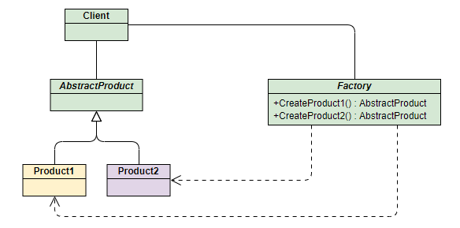

面临**耦合性、内聚性、可维护性、可扩展性、重用性、灵活性**等方面挑战，通过设计模式使程序具有更好的：

代码重用性、可读性、可扩展性、可靠性、高内聚低耦合

##  设计模式七大原则

1. 单一职责原则

2. 接口隔离原则

3. 依赖倒转（倒置）

   原则: **面向接口编程**

   三种方式：

   ​	通过接口传递实现依赖

   ​	通过构造方法依赖传递

   ​	通过setter实现 

4. 里氏替换原则

   继承可能带来侵入性，可移植性降低，父类修改要考虑所有的子类

   **在使用继承时**，子类中尽量**不要重写父类的方法**(继承增加了耦合性，可以通过聚合、组合、依赖来解决问题)

5. 开闭原则

    **对扩展开发**（对提供方），对修改关闭（对使用方）

6. 迪米特法则

   封装类内部信息，对外提供public方法，**最少知道原则**

   只与**直接朋友**通信：出现**成员变量、方法参数、方法返回值**中的类为直接朋友，出现在局部变量的类不是直接朋友。

7. 合成复用原则

   尽量使用合成/聚合，而不是使用继承


## UML 图

1. 用例图
2. 静态结构图：类图、对象图、包图、组件图、部署图
3. 动态行为图：交互图（时序图与协作图）、状态图、活动图

###  UML 类图

#### 1.类图基础属性


```none
-表示private  
#表示protected 
~表示default,也就是包权限  
_下划线表示static  
斜体表示抽象  
```

#### 2.类与类之间关系

在UML类图中，常见的有以下几种关系: **泛化（Generalization）, 实现（Realization），关联（Association)，聚合（Aggregation），组合(Composition)，依赖(Dependency)**


##### 2.1泛化

**介绍：**  
 泛化(Generalization)表示类与类之间的继承关系，接口与接口之间的继承关系，或类对接口的实现关系

（1）继承
 **介绍：**   

 继承表示是一个类（称为子类、子接口）继承另外的一个类（称为父类、父接口）的功能，并可以增加它自己的新功能的能力。
 **表示方法：**  

 继承使用**空心三角形+实线**表示。
 **示例：**  

 鸟类继承抽象类动物


（2）实现
 **介绍：**   

 实现表示一个class类实现interface接口（可以是多个）的功能。
 **表示方法：**

​	1）**矩形表示法**  

​	 	使用**空心三角形+虚线**表示
 		比如：大雁需要飞行，就要实现飞()接口


​	2）**棒棒糖表示法**  

​		使用**实线**表示


##### 2.2依赖

**介绍：**   

对于两个相对独立的对象，当一个对象负责构造另一个对象的实例，或者依赖另一个对象的服务时，这两个对象之间主要体现为依赖关系。

**表示方法：**   

依赖关系用**虚线箭头**表示。

 **示例：**   

 动物依赖氧气和水。调用新陈代谢方法需要氧气类与水类的实例作为参数


##### 2.3关联

**介绍：**   

对于两个相对独立的对象，当一个对象的实例与另一个对象的一些特定实例存在固定的对应关系时，这两个对象之间为关联关系。

 **表示方法：**   

关联关系用**实线箭头**表示。

**示例：**   

企鹅需要‘知道’气候的变化，需要‘了解’气候规律。当一个类‘知道’另一个类时，可以用关联。


##### 2.4聚合

**介绍：**   

表示一种弱的‘拥有’关系，即has-a的关系，体现的是A对象可以包含B对象，但B对象不是A对象的一部分。 **两个对象具有各自的生命周期**。

**表示方法：**   

聚合关系用**空心的菱形+实线箭头**表示。

**示例：**   

每一只大雁都属于一个大雁群，一个大雁群可以有多只大雁。当大雁死去后大雁群并不会消失，两个对象生命周期不同。


##### 2.5组合

**介绍：**   

组合是一种强的‘拥有’关系，是一种contains-a的关系，体现了严格的部分和整体关系，**部分和整体的生命周期一样**。

**表示方法：**  

组合关系用**实心的菱形+实线箭头**表示，还可以使用连线两端的数字表示某一端有几个实例。

**示例：**   

鸟和翅膀就是组合关系，因为它们是部分和整体的关系，并且翅膀和鸟的生命周期是相同的。


## 设计模式概述

### 设计模式分类

1. **创建型模式**：**单例模式**、抽象工厂模式、原型模式、建造者模式、**工厂模式**
2. **结构型模式**：适配器模式、桥接模式、**装饰模式**、组合模式、外观模式、享元模式、**代理模式**
3. **行为型模式**：模板方法模式、命令模式、访问者模式、迭代器模式、**观察者模式**、中介者模式、备忘录模式、解释器模式、状态模式、策略模式、责任链模式

### 创建型模式

#### 单例模式 Singleton

java中java.lang.Runtime 就是单例模式

##### 1. 饿汉式（静态常量）

可能造成内存浪费，避免了多线程同步问题

```java
class Singleton() {
    // 构造器私有化
    private Singleton() {}
    //本类创建
    private final static Singleton instance = new Singleton();
    //提供getter
    public getInstance() {
        return instance;
    }
    
}
```

##### 2. 饿汉式（静态代码块）

同理造成内存浪费

```java
class Singleton() {
    private static Singleton instance;
    //通过静态代码块创建单例对象
    static {
        instance = new Singleton();
    }
    //提供getter
    public getInstance() {
        return instance;
    }
    
}
```

##### 3. 懒汉式（线程不安全）

```java
class Singleton() {
    private static Singleton instance;
    private Singleton() {}
    //提供getter
    public static Singleton getInstance() {
        if(instance == null) {
            instance = new Singleton();
        }
        return instance;
    }
    
}
```

##### 4. 懒汉式（线程安全）

方法同步效率太低

```java
class Singleton() {
    private static Singleton instance;
    private Singleton() {}
    //提供getter
    public static synchronized Singleton getInstance() {
        if(instance == null) {
            instance = new Singleton();
        }
        return instance;
    }
    
}
```

##### 5. 双重检查

```java
class Singleton() {
    //volatile 禁止指令重排
    private static volatile Singleton instance;
    private Singleton() {}
    public static Singleton getInstance() {
        if(instance == null) {
            synchronized (Singleton.class) {
                if(instance == null) {
                    instance = new Singleton();
                }
            }
        }
        return instance;
    } 
}
```

##### **6. 静态内部类**

```java
class Singleton() {
  private Singleton() {}
  //懒加载 线程安全 静态内部类
  public static class SingletonInstance {
    private static final Singleton INSTANCE = new Singleton();
  }
  public static Singleton getInstance() {
    return SingletonInstance.INSTANCE;
  }
}
```

##### **7. 枚举**

避免多线程，还能防止反序列化重新创建新的对象

```java
enum Singleton {
  //属性单一
  INSTANCE;
  public vod sayOK() {}
}
```


#### 工厂模式 Factory

java中Calendar就是工厂模式

##### 1. 简单工厂模式



```java
public class PhoneFactory {
    public Phone makePhone(String phoneType) {
        if(phoneType.equalsIgnoreCase("MiPhone")){
            return new MiPhone();
        }
        else if(phoneType.equalsIgnoreCase("iPhone")) {
            return new IPhone();
        }
        return null;
    }
}
```

##### 2. 工厂方法模式

定义一个抽象工厂，定义生产接口但不具体负责产品，交给派生类工厂来生产。


```java
public interface AbstractFactory {
    Phone makePhone();
}
```

##### 3. 抽象工厂模式

在AbstractFactory增加创建产品的接口，在具体子工厂中实现新加产品的创建。


#### 原型模式 Prototype

可以简化创建对象过程。需要为每一个类配备克隆方法，对于已有类进行改造时违背了OCP原则

java中Object类是所有类的根类，提供一个clone()方法，可以复制对象，需要实现接口Cloneable**（浅拷贝）**

spring中创建bean可以采用原型模式

```xml
<bean id="id01" class="com.jackyjinchen.bean.Test" scope="prototype"/>
```


```java
// Cloneable 浅拷贝
// clone方法的原理是从堆内存中以二进制流的方式进行拷贝，直接分配一块新内存。
public abstract class Shape implements Cloneable {
   //.......
   @Override
   public Object clone() {
      Object clone = null;
      try {
         clone = super.clone();
      } catch (CloneNotSupportedException e) {
         e.printStackTrace();
      }
      return clone;
   }
}
```


```java
// 深拷贝
public class DeepProtoType impements Serializable, Cloneable {
  public DeepCloneableTarget deepCloneableTarget; //引用类型
  
  // 方法1
  @Override
  public Object clone() {
    Object clone = null;
    try {
      //基本数据属性克隆
      clone = super.clone();
      //对应用类型的属性，进行单独处理
      DeepProtoType deep = (DeepProtoType)deep;
      deep.deepCloneableTarget = (DeepCloneableTarget)deepCloneableTarget.clone();
    } catch (CloneNotSupportedException e) {
      e.printStackTrace();
    }
    return clone;
  }
  
  // 方法2
  public DeepProtoType deepClone() throws Exception {
    DeepProtoType clone = null;
    try {
      //将对象写到流里
      ByteArrayOutputStream bos = new ByteArrayOutputStream();
      ObjectOutputStream oos = new ObjectOutputStream(bos);
      oos.writeObject(this);
      //从流中读出来
      ByteArrayInputStream bis = new ByteArrayInputStream(bos.toByteArray());
      ObjectInputStream ois = new ObjectInputStream(bis);
      clone = (DeepProtoType) ois.readObject();
    } catch (CloneNotSupportedException e) {
      e.printStackTrace();
    } finally {
      bos.close();
      oos.close();
      bis.close();
      ois.close();
    }
    return clone;
  }
}
```

#### 建造者模式 Builder

java中的StringBuilder就是建造者模式


（1） 抽象产品类 computer。
（2） Builder 抽象 Builder，规范产品的组建，一般是由子类实现具体的组建过程。
（3）MacbookBuilder 具体的Builder类，具体的创建对象的类。
（4） Directror 统一组建过程。

### 结构型模式

#### 适配器模式 Adapter

将某个类的接口转换成客户端期望的另一个接口表示，主要目的是**兼容性**，别名包装器（Wrapper）。

(1). 目标（Target）接口：当前系统业务所期待的接口，它可以是抽象类或接口。
(2). 适配者（Adaptee）类：它是被访问和适配的现存组件库中的组件接口。
(3). 适配器（Adapter）类：它是一个转换器，通过继承或引用适配者的对象，把适配者接口转换成目标接口，让客户按目标接口的格式访问适配者。

##### 1. 类适配器


```java
// 适配器类
public class VoltageAdapter extends Voltage220V implements IVoltage5V {
    // 通过实现接口的方法将电压转化
    @Override
    public int output5V() {
        // 获取到 220V 电压
        int srcV = output220V();
        // 转成 5V
        intdstV = srcV / 44;
        return dstV;
    }
}
```

